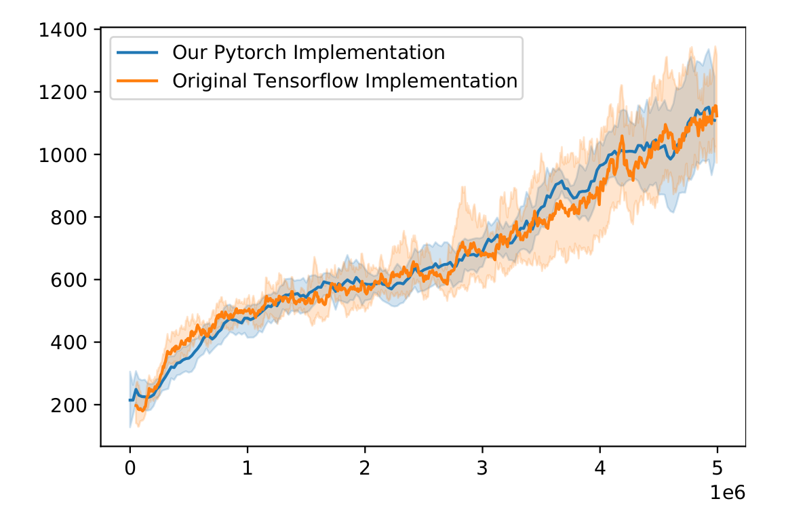

# DreamerV2 Pytorch

Pytorch implementation of DreamerV2 agent as in [Mastering Atari with Discrete World Models](https://arxiv.org/abs/2010.02193), based heavily on the original [danijar's Tensorflow 2 implementation](https://github.com/danijar/dreamerv2).
This implementation also follows closely the code structure as the original.

This repo intends to approximate as close as possible the results obtained by the original Tensorflow 2 implementation.

[comment]: <> (As such, this repository also includes some simple tests to ensure close outputs between Tensorflow and Pytorch implementations.)


### Install dependencies:

```sh
#install pytorch using conda or pip -> follow the instructions here https://pytorch.org

# install ffmpeg for saving agents gifs
# code for Ubuntu/debian
sudo apt install ffmpeg


#install other dependencies
pip3 install -r requirements.txt
```

### Train the agent:

```sh
python3 dreamerv2/train.py --logdir ~/logdir/atari_pong/dreamerv2/1 --configs defaults atari --task atari_pong
```

### Monitor results:

```sh
tensorboard --logdir ~/logdir
```

### Testing environments (playing as a human)
```sh
python dreamerv2/play_test.py --env SpaceInvaders-v0 
```

### Playing inside the agent dream!


```sh
python dreamerv2/play.py --configs defaults atari --task atari_space_invaders --logdir /logdir/space_invaders_logdir
```

---

Features:
+ FP16 pytorch support
+ Custom distributions and optimizers that closely match the tensorflow counterparts
+ support logging to Wandb (you need to put imports on train.py though)

Not implemented (converted from original):
+ Plan2Explore
+ ram observation
+ right now as implemented, doesn't support learning the actor by propagating the value network (torch.no_grad())
+ the replay buffer dataloaders are synchronous for now (no workers)


### Replication of results



Comparison of the Space Invaders Atari game learning performance over our implementation (Pytorch)
vs the original implementation (Tensorflow), while using the same hyperparameters. 

Results averaged over 5 randomly-seeded runs.

#### Pre-trained models

link: https://drive.google.com/drive/folders/1md-5Q5Ewh0a9EwCUb8LcQNSPE6IO8iPb?usp=sharing
